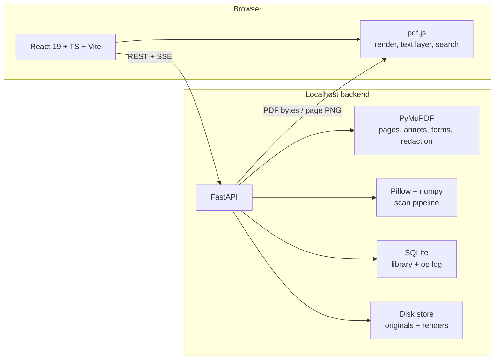

# Plan: Web-based PDF Editor with Scan Effect

Goal: a browser application that opens, views and edits PDFs in the style of Adobe
Acrobat Pro, including a "Save as scan" feature equivalent to
[scan_effect.py](scan_effect.py).

---

## 1. Scope

### 1.1 Must have (v1)

| Area | Feature |
| --- | --- |
| View | Open local PDF, paginated + continuous scroll, zoom, fit width/page, thumbnails sidebar, text search |
| Page ops | Reorder, rotate, delete, duplicate, insert blank, extract pages, merge PDFs, split |
| Annotate | Highlight, underline, strikeout, freehand ink, sticky note, rectangle/ellipse/arrow/line, text box, image stamp |
| Edit content | Add new text boxes, place images, redact (true content removal), fill existing AcroForm fields, best-effort replace of a single existing text span |
| Sign | Draw / type / upload signature, place as stamp |
| Export | Save PDF, flatten annotations, export pages as PNG/JPEG |
| Scan effect | Convert a PDF to an image-only "scanned" PDF with configurable preset |
| Files | Drag-and-drop open, download result, recent files (local) |

### 1.2 Later (v2)

- OCR text layer (Tesseract) so scanned output stays searchable.
- Compression / optimise, strip metadata.
- Password protect (encrypt) and unlock.
- Page numbering, headers/footers, watermarks, Bates numbering.
- Compare two PDFs.

### 1.3 Explicit non-goals (v1)

- Real-time multi-user collaboration.
- Full desktop-parity content reflow editing.
- Digital certificate signing (PAdES / eIDAS). Note: "signature image" is not a legal
  digital signature; keep the distinction visible in the UI.
- Cloud storage integrations (Drive, Dropbox).

---

## 2. Architecture: server-first, localhost only

Decided: **Python FastAPI backend owns every PDF mutation; the browser is a viewer and
control surface.** The whole stack runs on `127.0.0.1` for a single user.



Rationale:

- Reuses [scan_effect.py](scan_effect.py) as the actual engine rather than reimplementing
  it, so the saved file has genuine raster quality, not a CSS approximation.
- PyMuPDF server-side unlocks features the browser cannot do properly: true redaction,
  `bake()` flattening, AcroForm manipulation, encryption, text-span replacement.
- No browser memory ceiling on 300 DPI rasterisation of long documents.
- Localhost binding keeps documents on the machine, so the privacy property is preserved
  without giving up server capability.

The browser still uses pdf.js for viewing, because server-rendered page images would lose
text selection, search and crisp zoom. pdf.js is read-only in this design; it never writes.

---

## 3. Technology choices

### 3.1 Frontend

| Concern | Choice | Why |
| --- | --- | --- |
| Framework | React 19 + TypeScript + Vite | Ecosystem, fast dev server, first-class TS |
| Rendering | `pdfjs-dist` (Mozilla pdf.js) | Canonical browser renderer, text layer + search |
| Annotation UI | Custom overlay on pdf.js canvas, geometry stored in PDF points | Full control, no SDK lock-in |
| Canvas drawing | `fabric.js` v6 | Selection, transform handles and hit-testing for free |
| State | Zustand + immer | Simple stores, structural sharing |
| Undo/redo | Server-side op log with `undo`/`redo` endpoints | Single source of truth; survives reload |
| Data fetching | TanStack Query | Cache invalidation per document version |
| Styling | Tailwind + shadcn/ui | Fast, accessible primitives |
| Testing | Vitest + Playwright | Unit and e2e |

### 3.2 Backend

| Concern | Choice | Why |
| --- | --- | --- |
| API | FastAPI + uvicorn, Python 3.13 | Async, Pydantic v2 validation, OpenAPI for free |
| PDF engine | PyMuPDF (`pymupdf`) | Pages, annotations, forms, true redaction, `bake()`, encryption |
| Imaging | Pillow + numpy | Already used by `scan_effect.py` |
| Persistence | SQLite via SQLModel/SQLAlchemy + files on disk | Local library, no server to administer |
| Long jobs | `BackgroundTasks` + SSE progress endpoint | No Redis or Celery needed for one user |
| Packaging | `uv` for deps, single `docker compose` as an option | Reproducible env |
| Testing | pytest + `pytest-asyncio` + `httpx.AsyncClient` | API and pipeline coverage |

Licensing: pdf.js is Apache-2.0, fabric.js MIT, FastAPI MIT. **PyMuPDF is AGPL-3.0** (or a
paid commercial licence). For a personal, locally-run, open-source tool that is fine, and
the project itself should then be published under AGPL-3.0. If it is ever distributed as a
hosted or closed product, swap the engine for `pypdf` + `pikepdf` (BSD/MPL) and accept a
reduced feature set. This is a deliberate, recorded decision.

### 3.3 Scan effect

`scan_effect.py` becomes `backend/app/scan/pipeline.py`, extended with a full parameter
model instead of three fixed presets. The browser never runs the effect for real output:
it requests a low-DPI preview of one page while you drag sliders, and the final save is
done at full DPI by the same code path. Exact stage order, formulas and parameter ranges
are specified in [TECH-SPEC-pdf-studio.md](TECH-SPEC-pdf-studio.md).

Added beyond the current script:

- Paper texture / fibre overlay, dust specks, edge shadow (book-gutter) for realism.
- Scanner colour profiles: pure grayscale, warm white, cool grey, faded photocopy.
- Per-page variation of skew, brightness and noise so pages are not identical.
- Deterministic `seed` so any result can be reproduced exactly.
- User-defined presets saved to the library, plus the built-in `subtle` / `medium` /
  `heavy` starting points.

---

## 4. Decisions taken

| # | Question | Decision |
| --- | --- | --- |
| 1 | Runtime model | Server-first: Python FastAPI backend, React frontend |
| 2 | Deployment | Localhost only, single user, `127.0.0.1` bind |
| 3 | Auth | None. No login, no accounts |
| 4 | Storage | Persistent local library on disk + SQLite index, not ephemeral temp files |
| 5 | Licensing / SDK | Fully open source, no commercial SDK. Project is AGPL-3.0 because of PyMuPDF |
| 6 | Browsers | Desktop evergreen only (Chrome, Edge, Firefox, Safari). No mobile work |
| 7 | Scan fidelity | Must look convincing and be a real raster on save, with tunable parameters per scan type. No pixel-parity requirement against the Python script |
| 8 | Existing-text editing | Best-effort single-span replace via PyMuPDF redaction + font substitution. Reflow is out of scope |
| 9 | v1 contents | M1 through M5 all in scope for the first usable version |
| 10 | Repo | New `pdf-studio` repo, scaffolded here, moved to its own folder at coding time |

Still open, low urgency: product name and branding. Neutral default `PDF Studio` used
until told otherwise.

### 4.1 Acceptable-use note

The scan feature exists for archival look-and-feel, OCR pipeline testing and print proofs.
It must not be used to pass off altered documents as authentic originals. The UI carries a
one-line notice on the scan panel, and the tool never strips or forges existing digital
signatures.

---

## 5. Milestones

| # | Milestone | Contents | Exit criteria |
| --- | --- | --- | --- |
| M0 | Skeleton | FastAPI + uvicorn, Vite + React + TS, SQLite schema, upload/library, lint, pytest, Vitest | Upload a PDF and see it listed |
| M1 | Viewer | pdf.js render, zoom, continuous scroll, thumbnails, text search | Open a 100-page PDF smoothly |
| M2 | Scan effect | Parameterised pipeline, presets, live single-page preview, SSE progress, full-DPI save | Saved PDF is convincingly scanned and reproducible from a seed |
| M3 | Page manager | Reorder, rotate, delete, duplicate, insert blank, extract, merge, split, undo/redo | Op log round-trips; export matches preview |
| M4 | Annotations | Ink, shapes, text box, highlight/underline/strikeout, sticky, image stamp, signature | Annotations persist, reopen and flatten correctly |
| M5 | Forms, redaction, text replace | AcroForm fill, true redaction, `bake()` flatten, single-span text replace | Redacted text absent from extracted text; replaced span renders correctly |
| M6 | Polish | Keyboard shortcuts, a11y, error states, perf pass, packaging | One-command start, no unhandled errors in e2e run |
| M7 | Later | OCR text layer, compression, encryption, watermarks, Bates, compare | Per-feature acceptance |

---

## 6. Key risks

| Risk | Impact | Mitigation |
| --- | --- | --- |
| High-DPI rasterisation of long documents is slow | Perceived hang | Page-by-page streaming with SSE progress, cancellable jobs, DPI cap scaled by page count |
| Editing existing text is genuinely hard | Feature gap vs Acrobat | Single-span replace only, clearly labelled in the UI; never promise reflow |
| True redaction done wrong leaks data | Serious data leak | Use `add_redact_annot` + `apply_redactions`, never a drawn black box; automated test asserts the string is gone from extracted text and from image pixels |
| Corrupt or malicious PDFs | DoS, parser crash | Size and page caps, MIME sniff, per-request timeout, `isEvalSupported: false` in pdf.js, PDF JavaScript disabled |
| Local server exposed beyond the machine | Data exposure | Bind `127.0.0.1` only, strict CORS allowlist to the Vite origin, no `0.0.0.0` default |
| Path traversal via document ids or filenames | Arbitrary file read/write | Ids are UUIDs, never user filenames; every path resolved and asserted to be inside the store root |
| PyMuPDF AGPL obligation | Licensing | Project published AGPL-3.0; recorded in section 3.2 |
| Scan feature misused for forgery | Legal, reputational | Usage notice in the panel, no signature stripping, optional provenance metadata |
| Font licensing when embedding | Legal | Standard 14 plus bundled open fonts only |

---

## 7. Repository layout (proposed)

```
pdf-studio/
  backend/
    app/
      main.py            FastAPI app, CORS, lifespan
      config.py          settings (store root, caps, bind host)
      db.py              SQLite engine, session
      models.py          SQLModel tables
      schemas.py         Pydantic request/response models
      routers/           documents, pages, annotations, forms, redact, text, scan, export
      services/
        store.py         path resolution, safe file io
        oplog.py         op log, apply, undo/redo
        pdfops.py        PyMuPDF page + annotation + form operations
        render.py        page image rendering + cache
        textedit.py      single-span replace
      scan/
        params.py        ScanParams model + built-in presets
        pipeline.py      the effect stages (port of scan_effect.py)
        textures/        paper grain, dust overlays
    tests/
    pyproject.toml
  frontend/
    src/
      app/               shell, routes, layout
      components/        toolbars, panels, dialogs
      features/
        library/         document list, upload, drag-and-drop
        viewer/          pdf.js integration, page canvases, text layer, search
        pages/           thumbnail grid, reorder, rotate, delete
        annotate/        fabric overlay, tools, serialisation
        forms/           AcroForm binding
        redact/          region selection
        textedit/        span picker and replace dialog
        scan/            parameter sliders, live preview, save
        export/          save, flatten, image export
      lib/               api client, geometry, coordinate transforms
      state/             zustand stores
    tests/               Vitest + Playwright
  fixtures/              synthetic, non-personal sample PDFs only
  scripts/               make_fixtures.py, dev runners
  docker-compose.yml     optional single-command run
```

Fixture policy: never commit or test against real documents. All samples are generated
by `scripts/make_fixtures.py` (lorem text, a table, an AcroForm, an embedded image, a
multi-page doc) so they can live in the repo safely and produce stable output.

Scan tests assert structural properties (page count, image-only content, DPI, size bounds,
determinism for a fixed seed) plus a perceptual-diff baseline generated from the synthetic
fixtures, never from a real document.

---

## 8. Immediate next steps

1. Read [TECH-SPEC-pdf-studio.md](TECH-SPEC-pdf-studio.md), which contains the API
   contract, data model, coordinate rules and pipeline formulas Codex needs.
2. Scaffold M0: FastAPI app, SQLite schema, library, and the Vite frontend shell.
3. M1 viewer, then M2 scan effect with the tuning panel.
4. M3 to M5 in order, each behind its own set of tests.
